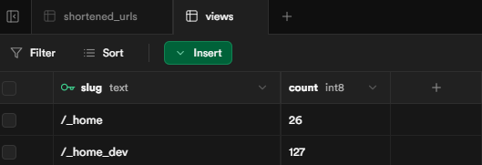

# 카트라이더 캐릭터로 알아보는 성격 테스트


기존 성격 유형 테스트를 카트라이더라는 주제에 맞게 재구성해보았습니다.

## ✅ 사용 기술

- Astro v5
- Vue3
- tailwind css v4
- supabase

### ✨ Astro + Vue

Astro js의 가장 큰 장점이라고 한다면,


## 🛠️ 개발 서버 명령어

| Command                   | Action                                           |
| :------------------------ | :----------------------------------------------- |
| `npm install`             | Installs dependencies                            |
| `npm run dev`             | Starts local dev server at `localhost:4321`      |
| `npm run build`           | Build your production site to `./dist/`          |
| `npm run preview`         | Preview your build locally, before deploying     |
| `npm run astro ...`       | Run CLI commands like `astro add`, `astro check` |
| `npm run astro -- --help` | Get help using the Astro CLI                     |

## 🌊 프로젝트 흐름

### 📌 0. 초기화면

- 사용자가 input 창을 통해 테스트에 쓰일 이름을 직접 설정할 수 있습니다.
  - 이름을 말도 안되는 길이로 설정할 수 있기 때문에, input maxlength를 통해 `길이 제한 (최대 10자)` 을 추가하였습니다.

- 이름 설정 후 테스트 시작하기 버튼을 통해 테스트를 시작할 수 있습니다.
  - 만약 이름을 설정하지 않고, `테스트 시작하기 버튼을 누른경우` 이름을 먼저 입력해달라는 alert창을 띄웁니다.

- 몇명이 이 테스트에 참여했는지 알 수 있습니다. 해당 수치는 이름 설정 후 **테스트 시작하기 버튼을 눌렀을 때** supabase에 viewcount (조회수) 수치가 1 증가됩니다.
  - **테스트 시작하기 버튼을 눌렀을 때** 라는 조건을 추가하지 않고, 첫 화면에 진입했다고 viewcount를 1 늘려버리면 첫 화면에서 **새로고침 시, 수치가 계속 늘어나기 때문에** 이를 방지하기 위해 조건을 추가했습니다.

    

    조회수는 개발 환경과 프로덕션 환경 2개로 나뉘어서 별도로 카운팅됩니다.

  - 조회수 카운팅은 사실 db를 쓰면 복잡해질거 같아서, 처음에는 따로 조회수 관련 데이터를 보관하는 json파일을 만들어서 json에 보관했다가 가져다 쓰는 방식인 **file based json database** 를 사용하려 했으나, <br/><br/> 나중에 배포했을 때 이 파일을 어떻게 실제 DB처럼 관리해야할지도 모르겠고, 특히 배포를 하는곳이 **Netlify** 였는데, Netlify/Vercel과 같은 **서버리스 환경** 에서는 파일쓰기 권한이 없어서 애초에 불가능한 것이였고, 이를 가능하게 하려면 배포하지 않고 공부용으로 로컬 개발용으로만 쓰거나 자체 Node 서버를 구현해야해서 결국 그나마 쓰기 쉽다고 하는 Supabase를 쓰기로 결정하였습니다.<br/><br/>\*서버리스 환경: 개발자가 서버를 직접 관리하지 않고도 코드를 빌드하고 실행, 배포할 수 있는 애플리케이션 개발 및 실행 모델

### ✏️ 1. 테스트 진행화면 (/qustion)

- 총 15가지의 질문이 제공됩니다.
- 4가지의 선택지 중 1가지를 선택 후 **다음** 버튼을 통해 다음 질문으로 이동할 수 있습니다.
- 첫 질문일경우, **처음으로** 버튼을 통해 초기 화면으로 돌아갈 수 있습니다.
- 테스트 질문을 1개 이상 진행 한 경우, **이전** 버튼으로 한 단계 이전 질문으로 돌아가서 답변을 수정할 수 있습니다.
- 마지막 질문인경우, **다음** 버튼 대신 **결과보기** 버튼이 나오게 되며, 클릭 시 결과 페이지로 이동합니다.
- 테스트 진행 시 답변 관련 데이터를 **세션 스토리지**에 저장합니다.
  - 세션 스토리지에 저장하는 이유는, 테스트 진행 도중 페이지를 이탈하거나 새로고침을 했을 때 진행도를 유지 시키기 위함입니다.
    - 로컬 스토리지에 저장할 수도 있겠으나, 답변 데이터를 굳이 유지시킬만한 데이터도 아니고, 오래된 데이터는 자동으로 삭제하는 등의 데이터 관리 번거로움이 있을거 같아서 **브라우저를 닫으면 자동으로 지워지는 세션 스토리지** 를 선택했습니다.

  - 세션 스토리지에 저장되는 데이터는 다음과 같습니다.
    - userName (string): 초기화면에서 설정한 이름은 userName으로 저장되며, 로딩 컴포넌트와 결과 페이지에서 사용됩니다.

    - userResults (object): 테스트 진행 완료 후 결과 페이지에서 **테스트 결과 공유하기** 버튼을 통해 URL을 복사하고 해당 URL을 공유 했을 때, URL을 공유한 사용자의 결과를 가져오기 위해 사용됩니다. 또한, 결과를 얻은 후 **다시 테스트하기** 버튼을 통해 초기 화면으로 갔다가 브라우저 히스토리로 다시 결과 화면으로 돌아왔을 경우 결과 데이터를 찾지 못하는 오류를 방지합니다.

    - quizCompleted (boolean): 해당 사용자가 결과를 얻었는지에 대한 여부를 저장하여 결과 페이지에서 새로고침 했을 때, 로딩 컴포넌트 표출 여부를 결정합니다. **그렇지 않으면, 결과를 얻었음에도 불구하고 결과 페이지에서 새로고침 할 때마다 로딩 컴포넌트가 계속 표출되는 오류가 발생합니다.** <br/><br/> ❗이 데이터는 초기 화면의 **테스트 시작하기** 버튼을 누르면 삭제됩니다.

    - quizAnswers (array): 1 ~ 4번 중 몇번을 선택했는지 저장하여 선택한 답변이 초기화 되지 않도록 합니다. <br/><br/> 이 데이터는 결과 화면의 **다시 테스트하기** 버튼을 누르면 삭제됩니다.

    - currentQuestionIndex (number): 현재 진행도를 나타냅니다. 진행할 때마다 1씩 증가하며, 최대값은 14입니다. <br/><br/> ❗이 데이터는 결과 화면의 **다시 테스트하기** 버튼을 누르면 삭제됩니다.

### 📉 2. 테스트 결과 화면 (/result)

- 선택한 답변 데이터들을 바탕으로 결과를 표시합니다.
- 초기에 설정했던 username을 결과 페이지에서 표시합니다.
- 한줄요약, 장점, 단점, 자주 듣는말, 잘맞는 캐릭터, 안 맞는 캐릭터 등은 `data > characters.js` 객체를 통해 화면에 보여줍니다.
- **캐릭터 설명보기** 버튼을 통해 잘 맞는 캐릭터 혹은 안 맞는 캐릭터의 성격을 볼 수 있습니다.
- **다시 테스트하기** 버튼을 통해 초기 화면으로 돌아가여 다시 테스트할 수 있습니다.
- **질문으로 돌아가기** 버튼을 통해 테스트 진행 화면으로 돌아가서 답변을 다시 수정할 수 있습니다.
- **테스트 결과 공유하기** 버튼을 통해 내가 어떤 결과를 받았는지 서로 공유할 수 있습니다.

#### 📉 2-1. 쿼리 파라미터

- 결과가 나오게되면 쿼리 파라미터에 username을 포함한 해당 결과 데이터를 저장합니다.
  - 예를 들어, 결과가 디지니로 나왔을경우 아래 객체를 문자열로 변환 후 인코딩하여 Base64 형태로 저장합니다.<br/>

  ```js
  디지니: {
  	title: '디지니',
  	popupImage: '/images/profile/img-diz-profile.webp',
  	info: {
  		summary:
  			'조용하지만 깊은 내면을 가진 따뜻한 감성형. 혼자서도 잘하지만 누군가 옆에 있으면 더 힘이 나는 타입입니다.',
  		meritArray: ['공감 능력이 높고 섬세함', '관계 중심적으로 배려 깊음', '진심을 담아 행동함'],
  		shortcomingArray: [
  			'감정 기복이 있음',
  			'생각이 많아서 결정이 느릴 수 있음',
  			'쉽게 상처받을 수 있음'
  		],
  		commentArray: [
  			'겉보다 속이 더 단단한 사람.',
  			'생각보다 열정적이네?',
  			'자신보다 남을 더 우선적으로 배려하는 스타일.'
  		],
  		well: ['우니', '티이라'],
  		bad: ['크리스', '모스'],
  		originalExplanation:
  			'디지니는 수줍어하는 성격으로 차를 무서워했으나 다오가 카트운전 면허를 딴 이후 자신도 많은 노력을 하여 상당한 수준에 이르게 된 라이더입니다. 남자친구인 다오와 함께 악당 로두마니를 찾아 나서는 것이 지금 당장의 목표입니다. 곱상한 외모와는 달리 의외로 과감한 드라이빙을 할 때가 있습니다.'
  	},
  	image: '/images/characters/img-diz.webp'
  }
  ```

- `window.history.pushState()` 로 결과페이지에서 페이지 로드 없이 URL을 업데이트합니다. 이를 이용하여 `결과 -> 홈` 으로 갔다가 브라우저 뒤로가기를 통해 다시 결과 페이지로 오면 아까 받았던 결과 데이터를 다시 볼 수 있습니다.
  - window.history.pushState: 페이지를 로드하지 않고 URL만 변경하여 페이지 이동을 할 수 있으며, 이동 시 브라우저 히스토리에 저장되어 사용자는 뒤로가기/앞으로가기 등의 동작을 할 수 있습니다. 이 API는 SPA방식으로 구현 된 프레임워크에서 중요한 역할을 합니다.

#### 📉 2-2. 테스트 결과 공유

```
<!-- url 단축하기 전 -->

http://localhost:4321/result?username=gege&result=eyJ0aXRsZSI6IuuqqOyKpCIsInBvcHVwSW1hZ2UiOiIvaW1hZ2VzL3Byb2ZpbGUvaW1nLW1vcy1wcm9maWxlLndlYnAiLCJtZXRhRGVzY3JpcHRpb24iOiLssKjrtoTtlZjqs6Ag7Iuk7Jqp7KCB7J24IO2YhOyLpOyjvOydmOyekOyYiOyalC4iLCJpbmZvIjp7InN1bW1hcnkiOiLssKjrtoTtlZjqs6Ag7Iuk7Jqp7KCB7J24IO2YhOyLpOyjvOydmOyekC4g6riw7IigLCDquLDqs4QsIOu2hOyEneyXkCDqsJXtlZjqs6Ag6r647KSA7Z6IIOy1nOyEoOydhCDri6TtlZjripQg7YOA7J6F7J6F64uI64ukLiIsIm1lcml0QXJyYXkiOlsi6rCQ7KCVIOq4sOuzteydtCDsoIHqs6Ag7Iug66Kw6rCQIOyeiOydjCIsIuyekOq4sCDrtoTslbzsl5Ag64yA7ZWcIOuGkuydgCDsnbTtlbTrj4QiLCLqvrjspIDtlagsIOyLpOyaqeyEsSJdLCJzaG9ydGNvbWluZ0FycmF5IjpbIu2RnO2YhOydtCDrtoDsobHtlZjqs6Ag64uk7IaMIOustOuaneuane2VqCIsIuqwkOyEseyggeyduCDsnbTslbzquLDsl5DripQg67CY7J2R7J20IOyggeydjCIsIuymie2dpeyggSDrs4DtmZTsl5Ag7JW97ZWoIl0sImNvbW1lbnRBcnJheSI6WyLrp5DsnYAg7JeG64qU642wIOuToOuToO2VtC4iLCLssKjrs7Tri6Qg7IKs656M7J2EIOuNlCDsoovslYTtlZjrqbQg7Ja065ao6rmMPyIsIuyhsOyaqe2eiCDri6Qg7ZW064aT64qUIOyKpO2DgOydvC4iXSwid2VsbCI6WyLsl5DrnaAiLCLsvIDtlLwiXSwiYmFkIjpbIuuniOumrOuTnCIsIuyXkOumrOuLiCJdLCJvcmlnaW5hbEV4cGxhbmF0aW9uIjoi66qo7Iqk64qUIOuyhOu4lO2ekCDstZzqs6DsnZgg7Lm0IOunpOuLiOyVhCDsnoXri4jri6QuIOywqOyXkCDrjIDtlZwg7JWg7KCV7J20IOuCqOuLpOultOupsCwg7Iqk7Iqk66GcIOywqOufieydhCDsoJXruYTtlZjqs6Ag6rCc7KGw7ZWY64qUIOuKpeugpeq5jOyngCDqsJbstpgg66mL7KeEIOudvOydtOuNlOydtOyekCDsl5Tsp4Dri4jslrTsnoXri4jri6QuIOuqqOyKpOuKlCDroIjsnbTsiqTsl5DshJwg7ZWt7IOBIDHsnITrpbwg7LCo7KeA7ZWY64qUIOqyg-uztOuLpOuKlCDqvrjspIDtnogg7Iic7JyE6raMIOyViOyXkCDrk6TslrTsmKTripQg6rKD7J20IOynhOygle2VnCDsi6TroKXsnbTrnbzqs6Ag7IOd6rCB7ZWp64uI64ukLi4ifSwiaW1hZ2UiOiIvaW1hZ2VzL2NoYXJhY3RlcnMvaW1nLW1vcy53ZWJwIn0
```

```
<!-- url 단축 후 -->
http://localhost:4321/share/gege
```

긴 URL을 그대로 저장하는 것이 아닌, URL을 **share/(username)** 와 같은 형태로 짧게 단축하여 클립보드에 저장합니다.

  <br/>

즉, 공유하기의 로직은 다음과 같습니다.

  

  <br/>

  <!-- prettier-ignore -->

1. 사용자가 공유하기 버튼을 클릭함

2. `util > urlShortener.js` 의 `shortenUrl` 함수에서 URL 단축 api를 호출하여 공유용 단축 URL 생성 (URL 단축에 대한 자세한 코드는 `api > shorten.ts`)

3. Supabase에 `{ id (사용자 이름), original_url(단축하기 전 url) }` 로 저장됨.
4. 다른 사용자가 단축 URL (/share/홍길동)에 접속하면

   4-1. Supabase에서 id가 "홍길동"인 데이터를 찾아 original_url (기존 URL) 을 가져옴.

   4-2. `/share/홍길동` 경로로 접속한 페이지는 Supabase에서 찾은 original_url로 자동으로 이동시킴.

   4-3. 그렇게되면 사용자는 다른 사람이 테스트한 결과를 볼 수 있음.

---

이는 유명한 URL 단축 서비스인 <a href="https://bitly.com/pages/landing/bringing-us-all-a-bit-closer?gad_source=1&gad_campaignid=19684284166&gbraid=0AAAAAC3Maq4YViGWoIA6VcKbvnRZtBglm&gclid=Cj0KCQjw-NfDBhDyARIsAD-ILeBKXHTCFStR4LY1gUghnKMu6t4WAq95OJtTAckcd62V7P7ImgC6bqIaAm-jEALw_wcB" target="_blank">bitly</a> 와 유사하게 동작합니다.

#### 📉 2-3. 결과별 메타태그 생성

사용자의 테스트 결과에 따라 다른 메타태그가 설정됩니다.

예를 들어, A라는 사용자가 "디지니" 라는 결과를 받고 해당 URL을 SNS에 공유하면 메타 태그는 아래와 같이 변경되고,

```html
<title>A님은 디지니와 가장 비슷한 성격을 가지고있어요.</title>
<meta
	name="description"
	content="A님은 디지니와 가장 비슷합니다. 조용하지만 깊은 내면을 가진 따뜻한 감성형이에요."
/>
<meta property="og:image" content="/images/profile/img-diz-profile.webp" />
```

B라는 사용자가 "마리드" 라는 결과를 받고 해당 URL을 공유하면 메타 태그는 아래처럼 변경됩니다.

```html
<title>B님은 마리드와 가장 비슷한 성격을 가지고있어요.</title>
<meta
	name="description"
	content="B님은 마리드와 가장 비슷합니다. 사랑과 감정에 솔직한 낭만주의자예요."
/>
<meta property="og:image" content="/images/profile/img-marid-profile.webp" />
```

##### 2-3-1. SSR (서버 사이드 렌더링) 과 CSR (클라이언트 사이드 렌더링)

- Astro SSG
  - Astro는 기본적으로 SSG(Static Site Generation) 기반 프레임워크이지만 설정을 통해 SSR로 바꾸거나 SSG와 SSR를 혼합하여 사용할 수 있는 환경을 제공함.

  - SSG는 **Static Site Generation** 의 약자로, 모든 `.astro` 로 구성된 페이지는 **빌드 시 정적인 HTML 파일** 로 미리 생성됨. 즉, 입력이나 클릭 등과 같은 액션을 통해 콘텐츠가 동적으로 추가되거나 하는 것이 아닌, 블로그나 MDN처럼 문서 사이트와 같이 **변하지 않는 페이지** 라는 의미임.

  - Astro에서 SSR 활성화 방법은 두 가지가 있음.
    - `astro.config.mjs` 파일에서 `output: "server"`를 추가하면 모든 페이지가 SSR로 동작함.
    - 일부 페이지만 SSR로 동작하게 하고싶다면, 각 페이지 파일 상단에 `export const prerender = false;` 를 선언해주면 됨.

    > 참고: https://mycodings.fly.dev/blog/2023-10-30-astrojs-howto-use-ssr-in-astrojs-server-side-rendering#2-ssr-%EB%B0%A9%EC%8B%9D%EC%97%90%EC%84%9C-%EC%A0%95%EC%A0%81-%ED%8E%98%EC%9D%B4%EC%A7%80%EB%8F%84-%EA%B0%99%EC%9D%B4-%EC%82%AC%EC%9A%A9%ED%95%98%EA%B8%B0

- SSR
  - SSR은 서버에서 HTML을 생성할 때, 쿼리파라미터나 쿠키, DB 등만 사용할 수 있는데, 현재 `/result` 페이지는 사용자의 결과를 브라우저의 세션 스토리지와 같은 **클라이언트** 에서만 결정되므로, 서버쪽에서는 **사용자의 결과 정보를 알 수가 없음**.

  - 그래서 일단 `/result` 페이지에서는 메타태그를 아래와 같이 기본값으로 설정함.

    ```js
    const title = '카트라이더 캐릭터로 알아보는 성격 테스트';
    const description =
    	'나는 어떤 캐릭터의 성격일까? 카트라이더 캐릭터로 알아보는 성격 테스트를 해보세요!';
    const image = '/images/og/og.png';
    ```

- CSR
  - CSR 에서도 `document.title` 이나 meta 태그를 JS로 바꿀 수는 있지만, SNS 크롤러는 **js 실행전의 HTML (즉, 서버에서 받아온 HTML)** 만 읽으므로 공유 미리보기에 반영이 되지 않기 때문에 사실상 클라이언트에서 바꾸는건 의미가 없음.

<br/>

- 동적 라우팅 컴포넌트 (`/share/[id].astro`) + SSR
  - `/result` 페이지는 SSG 환경이므로 사용자에게 결과 페이지를 제공하지만, 의도한 동적인 메타태그 설정은 불가능하기 때문에, **각 사용자의 결과 미리보기 공유** 를 구현하기 위해 동적 라우팅 컴포넌트와 일부 페이지를 SSR로 바꿀 수 있는 `export const prerender = false;` 설정을 활용함.

  - 이 페이지를 통해 SSR 환경에서 Supabase에 있는 original_url (원본 URL)과 id (사용자 이름) 를 가져와서 메타태그를 동적으로 생성할 수 있었음.

  ```js
  if (characterInfo && characterInfo.title) {
  	title = `${username}님은 ${characterInfo.title}와 가장 비슷한 성격을 가지고있어요.`;
  	description = `${username}님은 ${characterInfo.title}와 가장 비슷합니다. ${character.metaDescription}`;
  	image = character.popupImage;
  }
  ```
  - `[id].astro` 에서 위 값들이 `<HtmlLayout>` 컴포넌트에 전달되어 SSR에서 동적인 메타태그를 구현할 수 있게 되었음.
