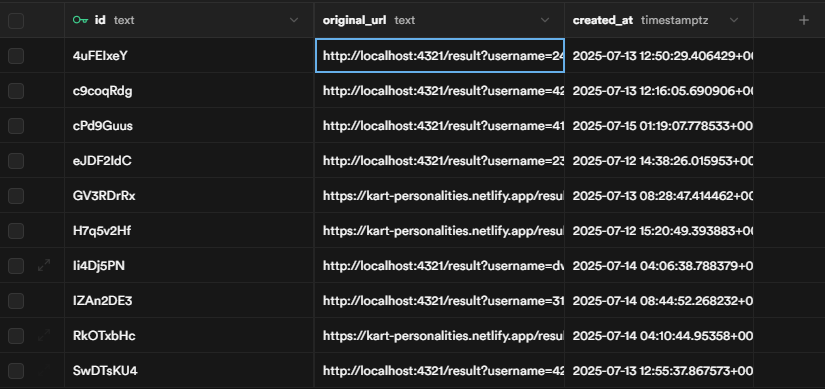

# 카트라이더 캐릭터로 알아보는 성격 테스트


기존 성격 유형 테스트를 카트라이더라는 주제에 맞게 재구성해보았습니다.

## ✅ 사용 기술

- Astro v5
- Vue3
- tailwind css v4
- supabase

### ✨ Astro와 Vue의 조합, 그리고 supabase

## 🛠️ 개발 서버 명령어

| Command                   | Action                                           |
| :------------------------ | :----------------------------------------------- |
| `npm install`             | Installs dependencies                            |
| `npm run dev`             | Starts local dev server at `localhost:4321`      |
| `npm run build`           | Build your production site to `./dist/`          |
| `npm run preview`         | Preview your build locally, before deploying     |
| `npm run astro ...`       | Run CLI commands like `astro add`, `astro check` |
| `npm run astro -- --help` | Get help using the Astro CLI                     |

## 🌊 프로젝트 흐름

### 📌 0. 초기화면

- 사용자가 input 창을 통해 테스트에 쓰일 이름을 직접 설정할 수 있습니다.
  - 이름을 말도 안되는 길이로 설정할 수 있기 때문에, input maxlength를 통해 `길이 제한 (최대 10자)` 을 추가하였습니다.

- 이름 설정 후 테스트 시작하기 버튼을 통해 테스트를 시작할 수 있습니다.
  - 만약 이름을 설정하지 않고, `테스트 시작하기 버튼을 누른경우` 이름을 먼저 입력해달라는 alert창을 띄웁니다.

- 이름 설정 후 `테스트 시작하기 버튼을 눌렀을 때` supabase에 viewcount (조회수) 수치가 1 증가됩니다.
  - `테스트 시작하기 버튼을 눌렀을 때` 라는 조건을 추가하지 않고, 첫 화면에 진입했다고 viewcount를 1 늘려버리면 첫 화면에서 **새로고침 시, 수치가 계속 늘어나기 때문에** 이를 방지하기 위해 조건을 추가했습니다.

### ✏️ 1. 테스트 진행화면 (/qustion)

- 총 15가지의 질문이 제공됩니다.
- 4가지의 선택지 중 1가지를 선택 후 **다음** 버튼을 통해 다음 질문으로 이동할 수 있습니다.
- 첫 질문일경우, **처음으로** 버튼을 통해 초기 화면으로 돌아갈 수 있습니다.
- 테스트 질문을 1개 이상 진행 한 경우, **이전** 버튼으로 한 단계 이전 질문으로 돌아가서 답변을 수정할 수 있습니다.
- 마지막 질문인경우, **다음** 버튼 대신 **결과보기** 버튼이 나오게 되며, 클릭 시 결과 페이지로 이동합니다.
- 테스트 진행 시 답변 관련 데이터를 **세션 스토리지**에 저장합니다.
  - 세션 스토리지에 저장하는 이유는, 테스트 진행 도중 페이지를 이탈하거나 새로고침을 했을 때 진행도를 유지 시키기 위함입니다.
    - 로컬 스토리지에 저장할 수도 있겠으나, 답변 데이터를 굳이 유지시킬만한 데이터도 아니고, 오래된 데이터는 자동으로 삭제하는 등의 데이터 관리 번거로움이 있을거 같아서 **브라우저를 닫으면 자동으로 지워지는 세션 스토리지** 를 선택했습니다.

  - 세션 스토리지에 저장되는 데이터는 다음과 같습니다.
    - userName (string): 초기화면에서 설정한 이름은 userName으로 저장되며, 로딩 컴포넌트와 결과 페이지에서 사용됩니다.

    - userResults (object): 테스트 진행 완료 후 결과 페이지에서 **테스트 결과 공유하기** 버튼을 통해 URL을 복사하고 해당 URL을 공유 했을 때, URL을 공유한 사용자의 결과를 가져오기 위해 사용됩니다. 또한, 결과를 얻은 후 **다시 테스트하기** 버튼을 통해 초기 화면으로 갔다가 브라우저 히스토리로 다시 결과 화면으로 돌아왔을 경우 결과 데이터를 찾지 못하는 오류를 방지합니다.

    - quizCompleted (boolean): 해당 사용자가 결과를 얻었는지에 대한 여부를 저장하여 결과 페이지에서 새로고침 했을 때, 로딩 컴포넌트 표출 여부를 결정합니다. **그렇지 않으면, 결과를 얻었음에도 불구하고 결과 페이지에서 새로고침 할 때마다 로딩 컴포넌트가 계속 표출되는 오류가 발생합니다.** <br/><br/> ❗이 데이터는 초기 화면의 **테스트 시작하기** 버튼을 누르면 삭제됩니다.

    - quizAnswers (array): 1 ~ 4번 중 몇번을 선택했는지 저장하여 선택한 답변이 초기화 되지 않도록 합니다. <br/><br/> 이 데이터는 결과 화면의 **다시 테스트하기** 버튼을 누르면 삭제됩니다.

    - currentQuestionIndex (number): 현재 진행도를 나타냅니다. 진행할 때마다 1씩 증가하며, 최대값은 14입니다. <br/><br/> ❗이 데이터는 결과 화면의 **다시 테스트하기** 버튼을 누르면 삭제됩니다.

### 📉 2. 테스트 결과 화면 (/result)

- 선택한 답변 데이터들을 바탕으로 결과를 표시합니다.
- 초기에 설정했던 username을 결과 페이지에서 표시합니다.
- 한줄요약, 장점, 단점, 자주 듣는말, 잘맞는 캐릭터, 안 맞는 캐릭터 등은 `data > characters.js` 객체를 통해 화면에 보여줍니다.
- **캐릭터 설명보기** 버튼을 통해 잘 맞는 캐릭터 혹은 안 맞는 캐릭터의 성격을 볼 수 있습니다.
- **다시 테스트하기** 버튼을 통해 초기 화면으로 돌아가여 다시 테스트할 수 있습니다.
- **질문으로 돌아가기** 버튼을 통해 테스트 진행 화면으로 돌아가서 답변을 다시 수정할 수 있습니다.
- **테스트 결과 공유하기** 버튼을 통해 내가 어떤 결과를 받았는지 서로 공유할 수 있습니다.
  - 클릭 시 기존 긴 형태의 URL 대신 단축된 URL이 클립보드에 복사되어 공유할 수 있습니다. <br/><br/>

  ```
  http://localhost:4321/result?username=412#eyJ0aXRsZSI6IuuUlOyngOuLiCIsInBvcHVwSW1hZ2UiOiIvaW1hZ2VzL3Byb2ZpbGUvaW1nLWRpei1wcm9maWxlLndlYnAiLCJpbmZvIjp7InN1bW1hcnkiOiLsobDsmqntlZjsp4Drp4wg6rmK7J2AIOuCtOuptOydhCDqsIDsp4Qg65Sw65y77ZWcIOqwkOyEse2YlS4g7Zi87J6Q7ISc64+EIOyemO2VmOyngOunjCDriITqtbDqsIAg7JiG7JeQIOyeiOycvOuptCDrjZQg7Z6Y7J20IOuCmOuKlCDtg4DsnoXsnoXri4jri6QuIiwibWVyaXRBcnJheSI6WyLqs7XqsJAg64ql66Cl7J20IOuGkuqzoCDshKzshLjtlagiLCLqtIDqs4Qg7KSR7Ius7KCB7Jy866GcIOuwsOugpCDquYrsnYwiLCLsp4Tsi6zsnYQg64u07JWEIO2WieuPme2VqCJdLCJzaG9ydGNvbWluZ0FycmF5IjpbIuqwkOyglSDquLDrs7XsnbQg7J6I7J2MIiwi7IOd6rCB7J20IOunjuyVhOyEnCDqsrDsoJXsnbQg64qQ66a0IOyImCDsnojsnYwiLCLsib3qsowg7IOB7LKY67Cb7J2EIOyImCDsnojsnYwiXSwiY29tbWVudEFycmF5IjpbIuqyieuztOuLpCDsho3snbQg642UIOuLqOuLqO2VnCDsgqzrnowuIiwi7IOd6rCB67O064ukIOyXtOygleyggeydtOuEpD8iLCLsnpDsi6Drs7Tri6Qg64Ko7J2EIOuNlCDsmrDshKDsoIHsnLzroZwg67Cw66Ck7ZWY64qUIOyKpO2DgOydvC4iXSwid2VsbCI6WyLsmrDri4giLCLti7DsnbTrnbwiXSwiYmFkIjpbIu2BrOumrOyKpCIsIuuqqOyKpCJdLCJvcmlnaW5hbEV4cGxhbmF0aW9uIjoi65SU7KeA64uI64qUIOyImOykjeyWtO2VmOuKlCDshLHqsqnsnLzroZwg7LCo66W8IOustOyEnOybjO2WiOycvOuCmCDri6TsmKTqsIAg7Lm07Yq47Jq07KCEIOuptO2XiOulvCDrlLQg7J207ZuEIOyekOyLoOuPhCDrp47snYAg64W466Cl7J2EIO2VmOyXrCDsg4Hri7ntlZwg7IiY7KSA7JeQIOydtOultOqyjCDrkJwg65287J20642U7J6F64uI64ukLiDrgqjsnpDsuZzqtazsnbgg64uk7Jik7JmAIO2VqOq7mCDslYXri7kg66Gc65GQ66eI64uI66W8IOywvuyVhCDrgpjshJzripQg6rKD7J20IOyngOq4iCDri7nsnqXsnZgg66qp7ZGc7J6F64uI64ukLiDqs7Hsg4HtlZwg7Jm466qo7JmA64qUIOuLrOumrCDsnZjsmbjroZwg6rO86rCQ7ZWcIOuTnOudvOydtOu5meydhCDtlaAg65WM6rCAIOyeiOyKteuLiOuLpC4ifSwiaW1hZ2UiOiIvaW1hZ2VzL2NoYXJhY3RlcnMvaW1nLWRpei53ZWJwIn0=
  ```

  예를 들어, 결과 페이지 URL이 위와 같을 때 **공유하기** 버튼으로 URL을 단축하게되면 아래와 같은 형태가 되며, 해당 URL에 접속할 경우 URL을 단축 URL에서 다시 기존 긴 형태의 URL로 바꿔서 결과 콘텐츠를 표시할 수 있게 합니다. <br/><br/> 이는 유명한 URL 단축 서비스인 bitly와 유사하게 동작합니다.

  ```
  http://localhost:4321/api/shorten/cPd9Guus
  ```
  - 공유하기 버튼을 누르면 결과 데이터를 DB에 저장하여 사이트에 한번도 방문하지 않은 사용자가 공유된 URL에 접속하여 다른 사용자의 결과를 볼 수 있습니다.<br/><br/>
    

- 결과가 나오게되면 URL 파라미터에 username을 포함한 해당 결과 데이터를 저장합니다.
  - 예를 들어, 결과가 디지니로 나왔을경우 아래 객체를 문자열로 변환 후 인코딩하여 Base64 형태로 저장합니다.<br/>

  ```js
  디지니: {
  	title: '디지니',
  	popupImage: '/images/profile/img-diz-profile.webp',
  	info: {
  		summary:
  			'조용하지만 깊은 내면을 가진 따뜻한 감성형. 혼자서도 잘하지만 누군가 옆에 있으면 더 힘이 나는 타입입니다.',
  		meritArray: ['공감 능력이 높고 섬세함', '관계 중심적으로 배려 깊음', '진심을 담아 행동함'],
  		shortcomingArray: [
  			'감정 기복이 있음',
  			'생각이 많아서 결정이 느릴 수 있음',
  			'쉽게 상처받을 수 있음'
  		],
  		commentArray: [
  			'겉보다 속이 더 단단한 사람.',
  			'생각보다 열정적이네?',
  			'자신보다 남을 더 우선적으로 배려하는 스타일.'
  		],
  		well: ['우니', '티이라'],
  		bad: ['크리스', '모스'],
  		originalExplanation:
  			'디지니는 수줍어하는 성격으로 차를 무서워했으나 다오가 카트운전 면허를 딴 이후 자신도 많은 노력을 하여 상당한 수준에 이르게 된 라이더입니다. 남자친구인 다오와 함께 악당 로두마니를 찾아 나서는 것이 지금 당장의 목표입니다. 곱상한 외모와는 달리 의외로 과감한 드라이빙을 할 때가 있습니다.'
  	},
  	image: '/images/characters/img-diz.webp'
  }
  ```

- `window.history.pushState()` 로 결과페이지에서 페이지 로드 없이 URL을 업데이트합니다. 이를 이용하여 `결과 -> 홈` 으로 갔다가 브라우저 뒤로가기를 통해 다시 결과 페이지로 오면 아까 받았던 결과 데이터를 다시 볼 수 있습니다.
  - window.history.pushState: 페이지를 로드하지 않고 URL만 변경하여 페이지 이동을 할 수 있으며, 이동 시 브라우저 히스토리에 저장되어 사용자는 뒤로가기/앞으로가기 등의 동작을 할 수 있습니다. 이 API는 SPA방식으로 구현 된 프레임워크에서 중요한 역할을 합니다.

-
